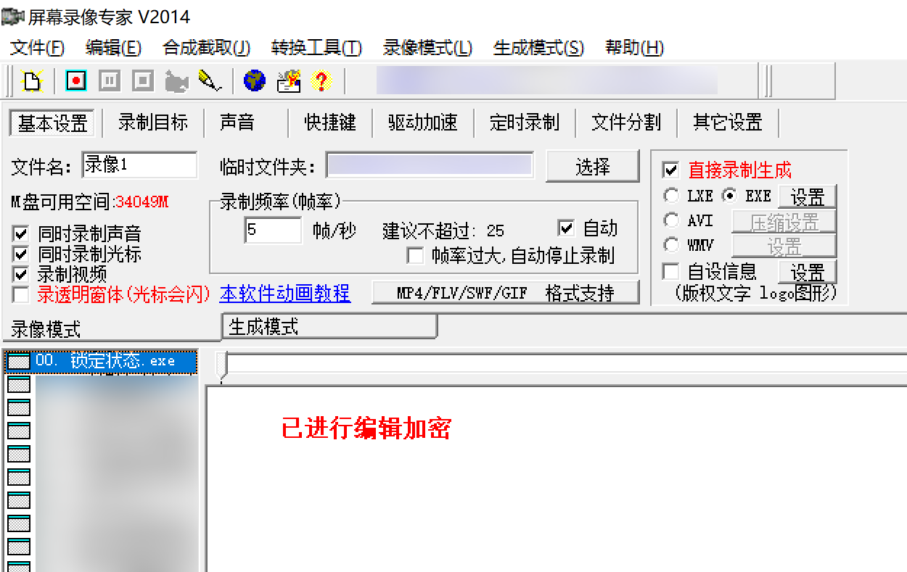
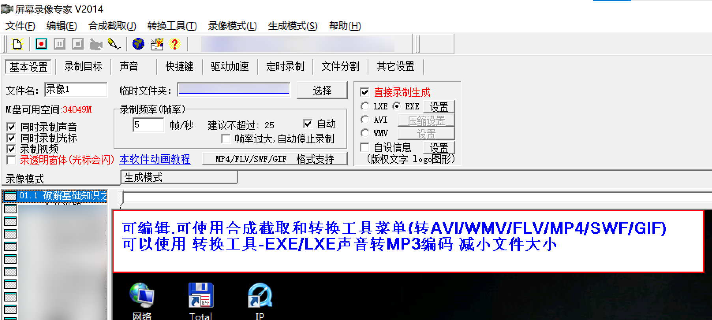

# 解除《屏幕录像专家》编辑锁定

用于解除使用屏幕录像专家对录像进行 “已进行编辑加密” 文件的解密。

解锁前：



解锁后：



by 爱飞的猫@52pojie.cn - 仅供学习交流用途

## 特性说明

支持：

- 音频提取 (仅限 wav)
- 解除“编辑加密”锁定

测试于下述《屏幕录像专家》版本生成的 EXE 播放器文件：

- V2014 Build 0318
- V2023 Build 0828

用到了 `zlib` 进行数据解压缩操作。

## 使用方法

首先使用 cmake + mingw 工具链编译。VS 或许可以，未测试。

```sh
cmake -B build -DCMAKE_BUILD_TYPE=Release .
cmake --build build
```

然后运行 `unlock` 指令解锁：

```shell
# Win
.\build\pmlxzj_unlocker.exe unlock "录像1.exe" "录像1_解锁.exe"

# Other
./build/pmlxzj_unlocker.exe unlock "录像1.exe" "录像1_解锁.exe"
```

其它支持的指令有 `audio-dump` 提取音频，和 `info` 查看信息。

## EXE 播放器格式

有两个数据段，通过文件结尾的数据进行读取 (`pmlxzj_footer_t`)。

其中 `offset_data_start` 指向视频数据的起始偏移，例如下述情况中的 `0xAAE0A`：

```text
                                       v 此处开始
00A:AE00  44 41 54 41 53 54 41 52 54 00|BB CD 28 FE 01 00  DATASTART.»Í(þ.. 
00A:AE10  00 00 56 05 00 00 00 03 00 00 43 43 00 00 05 00  ..V.......CC.... 
00A:AE20  00 00 C8 00 00 00 00 00 00 00 00 00 00 00 00 00  ..È............. 
00A:AE30  00 00 01 00 00 00 45 54 57 50 43 43 53 4B 59 47  ......ETWPCCSKYG 
00A:AE40  57 4D 43 58 4E 56 00 00 00 00 4B 54 4B 4D 4A 53  WMCXNV....KTKMJS 
00A:AE50  48 50 4A 00 57 4D 43 58 4E 56 00 00 00 00 AA 81  HPJ.WMCXNV....ª
```

该偏移指向的 `u32` 数值为 `0xFE28CDBB`，取负数得到对应的音频数据偏移 `0x1d73245`。

然后后面跳过一堆信息，就能抵达第一帧的地址 `0xab1b8`。

### 音频信息数据

只看了音频格式为 WAV + zlib 压缩的情况。大概格式如下：

```c
struct audio_segment {
    uint32_t compressed_size;
    uint8_t compressed_data[len];
};

struct audio_data {
    uint32_t segment_count;
    struct audio_segment[segment_count];
};
```

举例 `0x1d73245` 处的数据格式大体如下：

```text
1D7:3240                 F8 02 00 00 18 59 00 00 78 DA 85
1D7:3250  7D CB AE 64 4B ...
```

有 `0x2f8` 个音频段，第一段音频压缩后长度为 `0x5918`。

需要合并的话，将抽取的每一段解压缩，然后拼接就完成了。

### 视频信息数据

```
00A:B1B0                          F6 D4 01 00 84 A9 05 00
00A:B1C0  78 9C CC 7D 09 78 54 45 ...
```

大致结构如下：

```c
struct frame {
    uint32_t compressed_size;
    uint32_t decompressed_size;
    uint8_t compressed_data[compressed_size];
};
```

`78 9C` 是 `zlib` 压缩数据的特征，可以直接调用解压。解压后是什么格式我没看了，盲猜是某种图片格式。

“编辑加密” 启用的情况下，会在 `compressed_size > 10240` 的情况下进行：

- 在加密数据中间挑 20 个字节；
- 使其与 `nonce` 和 `compressed_data[0..20]` 进行位异或处理。

回到数据。第一帧比较特别，后续倒是都遵守一定格式：

```c
struct frame; // 参考上面

// 入口的第一帧
struct first_frame {
    struct frame; // 帧信息
    uint32_t frame_state; // 帧状态，未使用
    
    // field_24 == 1 的情况，会有两个额外的 f32 数据。
    if (field_24 == 1) {
        float unknown_1;
        float unknown_2;
    }
}

// 后续则是一直读取 `frame_data` 解构，直到结束
struct frame_data {
    // 未知数据流
    uint32_t stream2_len;
    uint8_t stream2[stream2_len];
    
    uint32_t frame_state; // 帧状态
    
    if (frame_state > 0) {
        // u32 *4，左上和右下的坐标。具体储存顺序没看。
        RECT patch_cord;
        
        while (frame_state > 0) {
            struct frame; // 帧信息
            uint32_t frame_state; // 帧状态
        }
    }
    
    // field_24 == 1 的情况，会有两个额外的 f32 数据。
    if (field_24 == 1) {
        float unknown_1;
        float unknown_2;
    }
};
```

具体怎么控制需要读到何时终止还不清楚。目前代码则是写死了越界到音频或读到 EOF 位置时结束。

### 意义不明

有很多地方还没搞懂，也有很多参数能控制读取文件的偏移。目前只是对着部分已知的文件进行测试。

## 解锁流程

- 初始化 EXE 播放器各种信息。拷贝输入到输出文件。
  - 不将整个文件放到内存，降低内存占用。
- 枚举所有的帧信息，并判断大小是否超过阈值。若超过：
  - 模拟原版解密流程，将数据进行位异或处理解码，并填充到对应位置
- 抹除“编辑锁定”时生成的随机值 `nonce`，使其标记为无锁定状态。

## 碎碎念

OBS 永远的神，屏幕录像专家可以说是时代的眼泪了…

XP 时代应该是它的巅峰（默认 5fps，录教程够了，低资源设备友好）。
不过感觉从 Win7 开始就有点力不从心 + 摆烂了。

本质上只是为了翻录到 MP4 格式方便传输。利用 OBS + 自动翻录脚本也能做到类似的效果。

一开始也想过所谓的“高度无损压缩”会是什么黑科技，结果却发现就是简单的 gzip 压缩有点失望。

此外逆向过程中发现了其内嵌了两个 txt 文件（换行分割的数组），怀疑是用来重放鼠标点击事件的信息。
在代码中的 `idx1` 和 `idx2` 为解析后的对应数据。

## 致谢

- Hmily 老师帮忙定位到了关键解密代码和大致解密流程。
